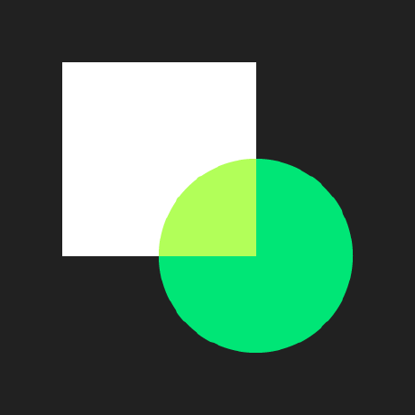

# Xamarin Binding for Material Components for iOS
Xamarin.iOS bindigs for Material Components for iOS (MDC-iOS).

[](https://www.bitrise.io/app/90b72d60b57288b7)
[](https://www.nuget.org/packages/Xamarin.iOS.MaterialComponents/)

<p align="center">

</p>

## Usage
- Scenario 1: Try the Sample app - Clone and open the MaterialComponents solution.

``` bash
git clone https://github.com/ilap/MaterialComponentsXamarin
open -a "Visual Studio" MaterialComponentsXamarin/MaterialComponentsBinding.sln
```

- Scenario 2: Use it in your project/solution - Install the [NuGet package](https://www.nuget.org/packages/Xamarin.iOS.MaterialComponents).

For further usage details, have a look at the [Samples](samples/) directory and the [API Documentation](https://material.io/components/ios/catalog/).

# Requirements

## Xamarin Binding Build
- The built MaterialComponents native framework and its dependent frameworks, see [Dependencies](src/README.md#framework-dependencies).
- VisualStudio for Mac.
- Xamarin.iOS

## MaterialComponents Framework Build on macOS/OS X.
- Xcode 8.3
- Pod


# Contribute

Thank yoo for your interest in this Xamarin Bindings and the sample code.
Here are some ways you can contribute to this project:

- Fix issues opened in GitHub against the binding source code and/or the sample.
- Fix API definitions in the [Binding Project](src/MaterialComponents/).
- Add a new features to the sample app.
- Add or improve comments to or in the sample code.


# Attributions #
This project uses some third-party assets with a license that requires attribution:

 - **[Material Design icons at Github](https://github.com/google/material-design-icons)**,
copyright Google Inc. and licensed under
[CC BY 4.0](https://creativecommons.org/licenses/by/4.0/).


 - **[Roboto Font at Google](https://www.google.com/fonts/specimen/Roboto)**, copyright [Christian Robertson](https://plus.google.com/110879635926653430880/about), and licensed under [Apache License 2.0](http://www.apache.org/licenses/LICENSE-2.0)


 - **[Raleway at Google Fonts](https://www.google.com/fonts/specimen/Raleway)**: copyright Matt McInerney, Pablo Impallari, Rodrigo Fuenzalida and by Igino Marini, and licensed [Open Font License](http://scripts.sil.org/cms/scripts/page.php?site_id=nrsi&id=OFL_web)

For extra information about licenses, you can see it at the dependency repositories.

# License #

The MIT License (MIT)

Copyright (c) 2017 The Material Components for iOS Xamarin Binding Authors.
All Rights Reserved.

Permission is hereby granted, free of charge, to any person obtaining a copy
of this software and associated documentation files (the "Software"), to deal
in the Software without restriction, including without limitation the rights
to use, copy, modify, merge, publish, distribute, sublicense, and/or sell
copies of the Software, and to permit persons to whom the Software is
furnished to do so, subject to the following conditions:

The above copyright notice and this permission notice shall be included in all
copies or substantial portions of the Software.

THE SOFTWARE IS PROVIDED "AS IS", WITHOUT WARRANTY OF ANY KIND, EXPRESS OR
IMPLIED, INCLUDING BUT NOT LIMITED TO THE WARRANTIES OF MERCHANTABILITY,
FITNESS FOR A PARTICULAR PURPOSE AND NONINFRINGEMENT. IN NO EVENT SHALL THE
AUTHORS OR COPYRIGHT HOLDERS BE LIABLE FOR ANY CLAIM, DAMAGES OR OTHER
LIABILITY, WHETHER IN AN ACTION OF CONTRACT, TORT OR OTHERWISE, ARISING FROM,
OUT OF OR IN CONNECTION WITH THE SOFTWARE OR THE USE OR OTHER DEALINGS IN THE
SOFTWARE.
