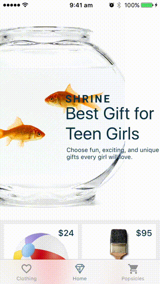
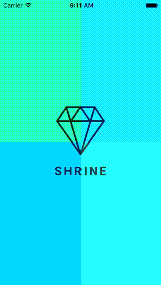

# Xamarin Binding for Material Components for iOS



Xamarin.iOS bindigs for Material Components for iOS (MDC-iOS).

[](https://www.bitrise.io/app/90b72d60b57288b7)
[](https://www.nuget.org/packages/Xamarin.iOS.MaterialComponents/)

## Usage
- Scenario 1: Try the Sample app - Clone and open the MaterialComponents solution.

``` bash
git clone https://github.com/ilap/MaterialComponentsXamarin
open -a "Visual Studio" MaterialComponentsXamarin/MaterialComponentsBinding.sln
```

- Scenario 2: Use it in your project/solution - Install the [NuGet package](https://www.nuget.org/packages/Xamarin.iOS.MaterialComponents).

For further usage details, have a look at the [Samples](samples/) directory and the [API Documentation](https://material.io/components/ios/catalog/).

# Current Version
 - v34.0.1 - Note: the versions follow the relevant MaterialComponents for iOS's versioning system.
   e.g. MaterialComponents for iOS vX.Y.Z --> MaterialComponentBinding vX.Y.Z.

# Requirements

## Xamarin Binding Build
- The built MaterialComponents native framework and its dependent frameworks, see [Dependencies](src/README.md#framework-dependencies).
- VisualStudio for Mac.
- Xamarin.iOS

## MaterialComponents Framework Build on macOS/OS X.
- Xcode 8.3
- Pod


# Contribute

Thank yoo for your interest in this Xamarin Bindings and the sample code.
Here are some ways you can contribute to this project:

- Fix issues opened in GitHub against the binding source code and/or the sample.
- Fix API definitions in the [Binding Project](src/MaterialComponents/).
- Add a new features to the sample app.
- Add or improve comments to or in the sample code.


# Attributions #
This project uses some third-party assets with a license that requires attribution:

 - **[Material Design icons at Github](https://github.com/google/material-design-icons)**,
copyright Google Inc. and licensed under
[CC BY 4.0](https://creativecommons.org/licenses/by/4.0/).


 - **[Roboto Font at Google](https://www.google.com/fonts/specimen/Roboto)**, copyright [Christian Robertson](https://plus.google.com/110879635926653430880/about), and licensed under [Apache License 2.0](http://www.apache.org/licenses/LICENSE-2.0)


 - **[Raleway at Google Fonts](https://www.google.com/fonts/specimen/Raleway)**: copyright Matt McInerney, Pablo Impallari, Rodrigo Fuenzalida and by Igino Marini, and licensed [Open Font License](http://scripts.sil.org/cms/scripts/page.php?site_id=nrsi&id=OFL_web)


This software contains demo code, samples, examples and tutorials derived from the Google Inc.'s 
Material Components for iOS project and licensed under Apache 2.0 without a NOTICE file.

Xamarin Binding of Material Components for iOS uses:
 - the Material Components for iOS and its dependends, copyright Google Inc. and licensed under Apache 2.0 without a NOTICE file.
 - the Material Design icons, copyright Google Inc. and licensed under CC BY 4.0.
 - the Roboto font, copyright 2011 Google Inc. and licensed under Apache 2.0 without a NOTICE file.

For extra information about licenses, you can see it at the dependency repositories.

# License #

Xamarin Binding of MaterialComponents for iOS
Copyright (c) 2017 The Material Components for iOS Xamarin Binding Authors.

Licensed under the Apache License, Version 2.0 (the "License");
you may not use this file except in compliance with the License.
You may obtain a copy of the License at

   http://www.apache.org/licenses/LICENSE-2.0

Unless required by applicable law or agreed to in writing, software
distributed under the License is distributed on an "AS IS" BASIS,
WITHOUT WARRANTIES OR CONDITIONS OF ANY KIND, either express or implied.
See the License for the specific language governing permissions and
limitations under the License.
